# Ejercicio 4 — Gestor de Archivos (Flutter)

Aplicación multiplataforma (Android / iOS) escrita en **Dart + Flutter** con arquitectura limpia, **Provider** como gestor de estado y **Hive** para la persistencia local. Es la versión multiplataforma del Gestor de Archivos del Ejercicio 2 y funciona **100 % sin conexión a internet**.

## Requisitos

| Herramienta | Versión usada | Mínimo |
|---|---|---|
| Flutter | 3.47.5 (stable) | 3.38 |
| Dart | 3.13.4 | 3.10 |
| Android Studio + Android SDK | SDK 36 | SDK 21 (Android 5.0) en el dispositivo |
| Emulador | Medium Phone (API 36) | Cualquier emulador o celular Android |
| Xcode (solo para iOS) | — | 15 o superior, en macOS |

Verificar el entorno con:

```powershell
flutter doctor
```

Deben aparecer con ✓ **Flutter** y **Android toolchain** (Visual Studio solo es necesario para apps de escritorio de Windows).

## Instalación

1. Clonar el repositorio y entrar a la carpeta del ejercicio:
   ```powershell
   cd HernandezAlonsoReyesOlascoaga_Prac3\Ejercicio4_Flutter
   ```
2. Descargar dependencias (**única vez que se necesita internet**):
   ```powershell
   flutter pub get
   ```
3. (Opcional) Verificar el código:
   ```powershell
   flutter analyze
   flutter test
   ```
   Debe mostrar `No issues found!` y `All tests passed!`.

> Las carpetas `android/` e `ios/` ya están en el repositorio. Si se borran o se quiere regenerarlas con otra versión de Flutter, ejecutar una vez `powershell -ExecutionPolicy Bypass -File .\configurar_plataformas.ps1`, que corre `flutter create` y aplica el nombre visible de la app y las claves de `Info.plist`.

## Ejecución

### Android (emulador)
```powershell
flutter emulators                      # lista los emuladores disponibles
flutter emulators --launch Medium_Phone # usar el ID que aparezca en la lista
flutter run
```
La primera compilación tarda varios minutos (Gradle descarga sus dependencias). Durante `flutter run`: `r` = hot reload, `R` = hot restart, `q` = salir.

Si después de cambiar versiones de paquetes aparece un error de compilación de Kotlin, limpiar la caché:
```powershell
flutter clean
flutter pub get
flutter run
```

### Generar el APK
```powershell
flutter build apk --release
```
El archivo queda en `build\app\outputs\flutter-apk\app-release.apk` y se puede instalar en cualquier celular Android.

### iOS
En macOS con Xcode 15 o superior:
```bash
flutter pub get
cd ios && pod install && cd ..
flutter run          # con un simulador de iPhone abierto
```

## Uso

| Pantalla | Qué hace |
|---|---|
| **Archivos** | Muestra las 3 ubicaciones del sandbox: `Documents`, `Inbox` y `Temporal (tmp)`. Tocar una carpeta para entrar. |
| Explorador | Buscar (barra superior), ordenar (↕ nombre / fecha / tamaño), importar (⬇), crear carpeta (📁+). Jalar hacia abajo para actualizar. |
| Acciones de archivo | Mantener presionado o tocar ⋮: favoritos, renombrar, duplicar, copiar a…, mover a…, compartir, abrir con otra app, eliminar. |
| Gestos | Deslizar a la **derecha** = marcar/quitar favorito. Deslizar a la **izquierda** = eliminar (pide confirmación). |
| Visor de imágenes | Pellizco o botones 🔍+/🔍− para zoom, arrastrar para desplazarse, rotar 90°, doble toque o ⛶ para ajustar a pantalla. |
| Visor de texto | Abre `.txt`, `.md`, `.json`, `.dart`, `.swift`, etc. ✏️ para editar y 💾 para guardar. |
| Otros archivos | PDF, video, audio, etc. se abren con el visor nativo del sistema. |
| **Favoritos** | Archivos marcados con ⭐. Deslizar a la izquierda para quitar. |
| **Recientes** | Últimos 25 archivos abiertos. 🗑 limpia el historial. |
| **Ajustes** | Tema **Guinda (IPN)** / **Azul (ESCOM)**, modo **Sistema / Claro / Oscuro**, última carpeta visitada y criterio de orden. |

En el primer arranque la app crea archivos de ejemplo en `Documents` (`Bienvenida.txt`, `Notas.md`, `datos_ejemplo.json`, `imagen_muestra.png` y la carpeta `Proyectos`) para probar todo sin conexión.

**Importar un archivo en el emulador:** arrastrar un archivo desde Windows a la ventana del emulador (se copia a *Descargas*) o usar `adb`:
```powershell
& "$env:LOCALAPPDATA\Android\Sdk\platform-tools\adb.exe" push "C:\ruta\archivo.pdf" /sdcard/Download/
```
y después ⬇ **Importar** dentro de la app.

## Arquitectura

```
lib/
├── main.dart                     # Inyección de dependencias y arranque
├── app.dart                      # MultiProvider + MaterialApp (temas claro/oscuro)
├── core/
│   ├── theme/app_theme.dart      # Temas Guinda (#9B023D) y Azul (#003E80)
│   └── utils/formatters.dart     # Formato de tamaños y fechas
├── domain/                       # Dart puro, sin dependencias de Flutter
│   ├── entities/                 # FileItem, SortOption, StorageLocation
│   ├── errors/                   # FileOperationException
│   ├── repositories/             # Contratos: FileRepository, PreferencesRepository
│   └── usecases/                 # FilterAndSortItems (búsqueda + orden)
├── data/
│   ├── datasources/              # path_provider (sandbox) y Hive (preferencias)
│   └── repositories/             # Implementaciones con dart:io y Hive
└── presentation/
    ├── providers/                # ChangeNotifier: Settings, Favorites, Recents, FileBrowser
    ├── screens/                  # Pantallas
    ├── widgets/                  # FileRow, EmptyState
    └── utils/                    # Diálogos y apertura de archivos
```

| Ejercicio 2 (Swift) | Ejercicio 4 (Flutter) |
|---|---|
| `ObservableObject` + `@EnvironmentObject` | `ChangeNotifier` + `Provider` |
| `UserDefaults` | Hive (caja `gestor_archivos_prefs`) |
| `FileManager` | `dart:io` + `path_provider` |
| `QLPreviewController` | `open_filex` (visor nativo) |
| `UIDocumentPickerViewController` | `file_picker` |
| `UIActivityViewController` | `share_plus` |
| `NSCache` (miniaturas) | `ResizeImage` + `ImageCache` |
| `AppTheme.accentColor` | `ColorScheme.fromSeed` (claro y oscuro) |

## Pruebas

`flutter test` ejecuta 11 pruebas: creación y listado de carpetas (sin archivos ocultos ni internos), duplicado sin sobrescribir, validación al renombrar, copiar una carpeta dentro de sí misma, mover, importar desde un flujo de bytes, lectura/escritura de texto, búsqueda y ordenamiento, detección de tipo de archivo, el widget `FileRow` y los colores de los temas.

## Evidencia

| Pantalla principal | Documents (Guinda, claro) |
|---|---|
| 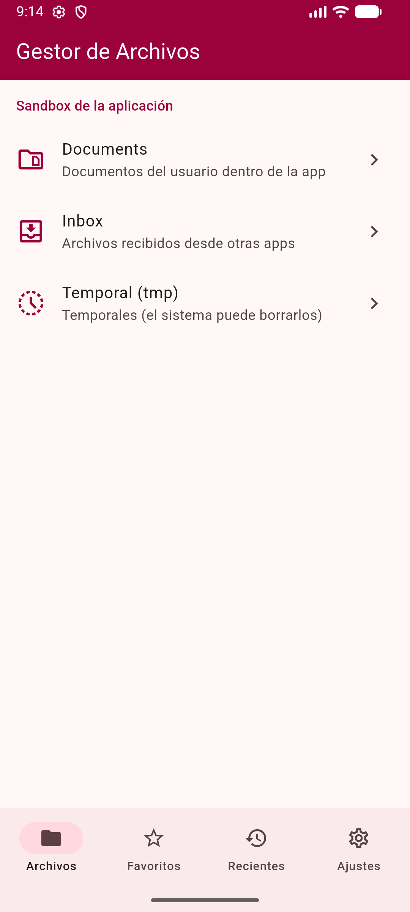 | 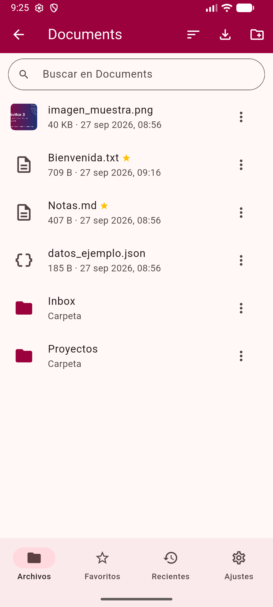 |

| Visor de imágenes | Zoom con botones |
|---|---|
| 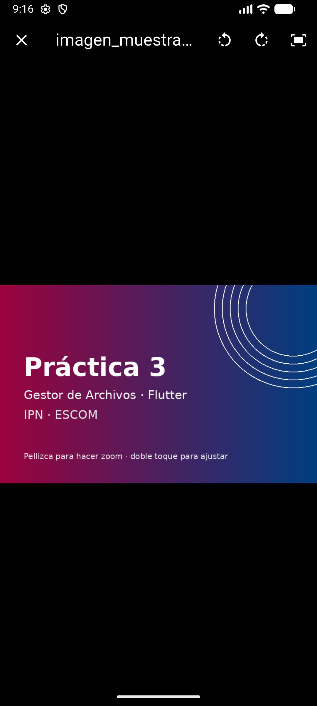 | 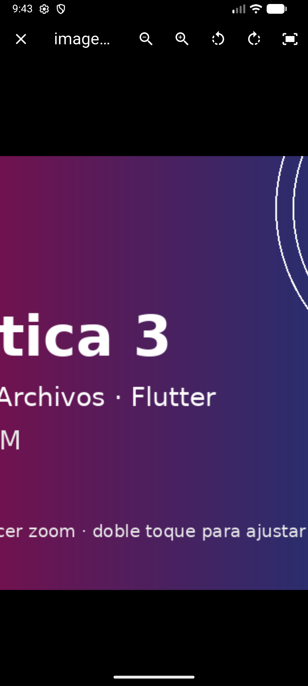 |

| Visor/editor de texto (guardado) | Menú contextual |
|---|---|
| 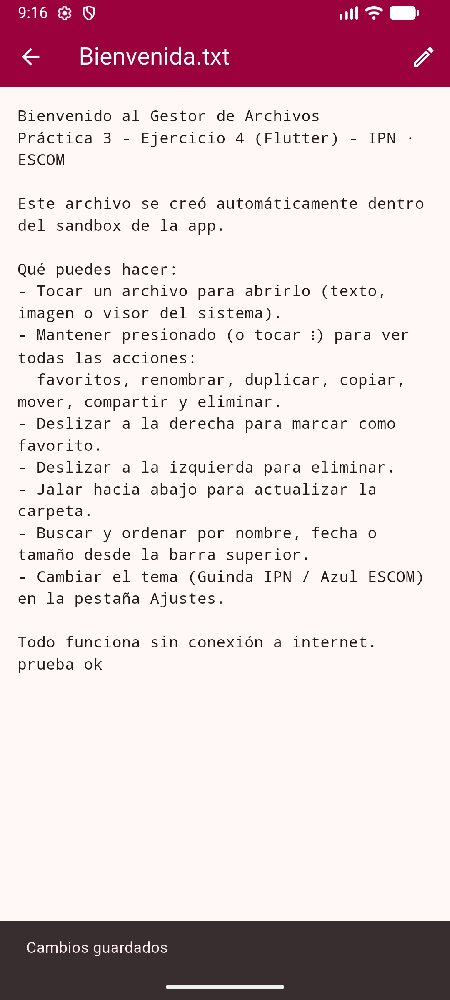 | 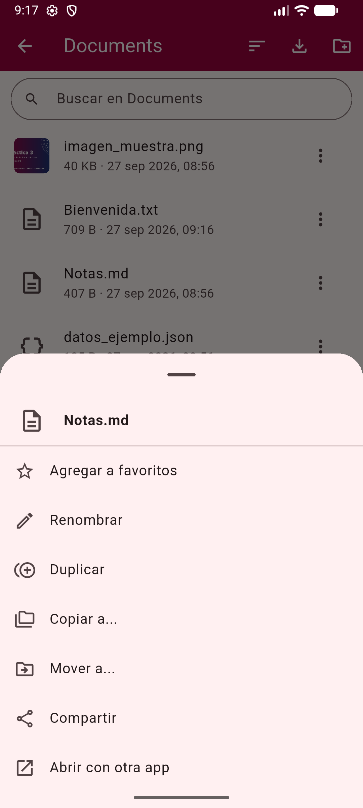 |

| Confirmación al eliminar (deslizar) | Favoritos |
|---|---|
| 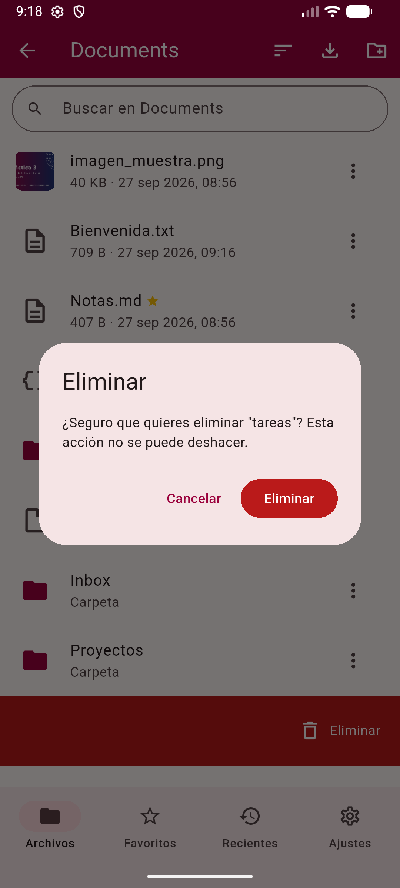 | 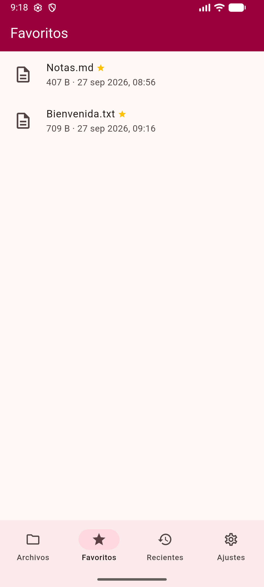 |

| Recientes | Importar archivo (PDF) |
|---|---|
| 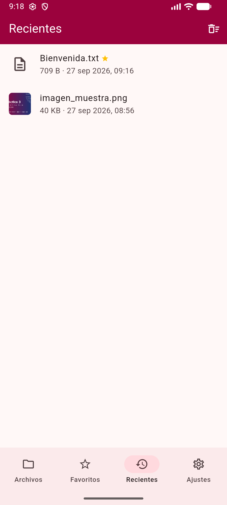 | 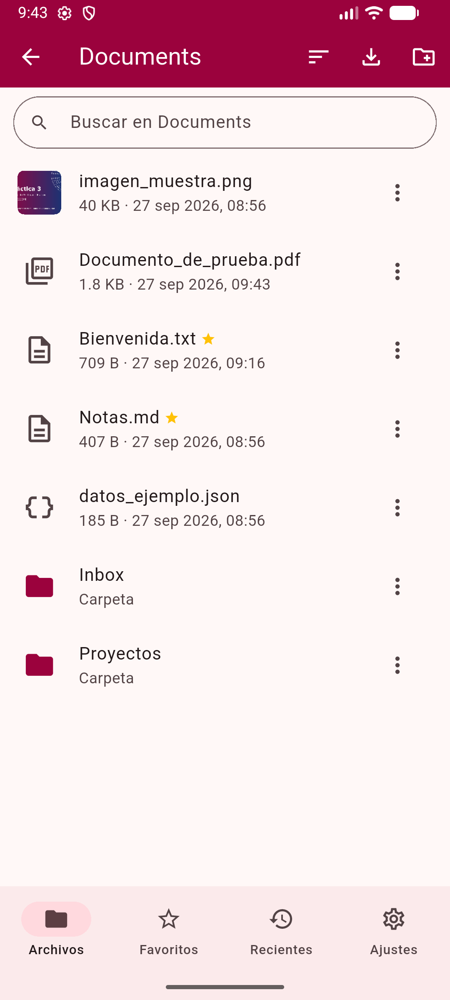 |

| PDF en el visor del sistema | Ajustes — Guinda claro |
|---|---|
| 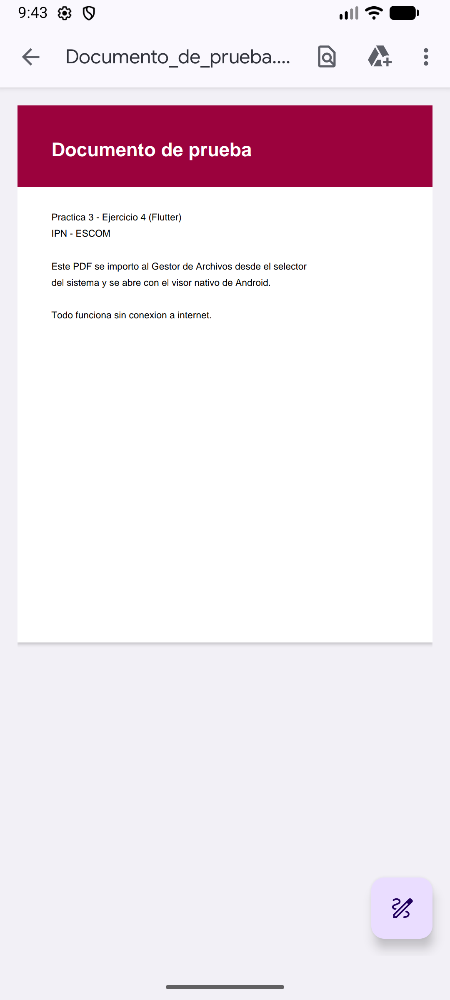 | 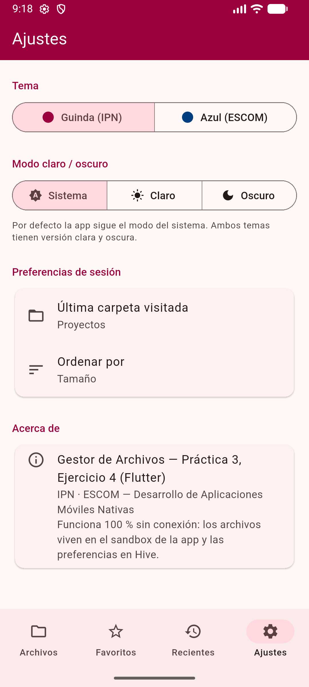 |

| Ajustes — Azul claro | Ajustes — Azul oscuro |
|---|---|
| 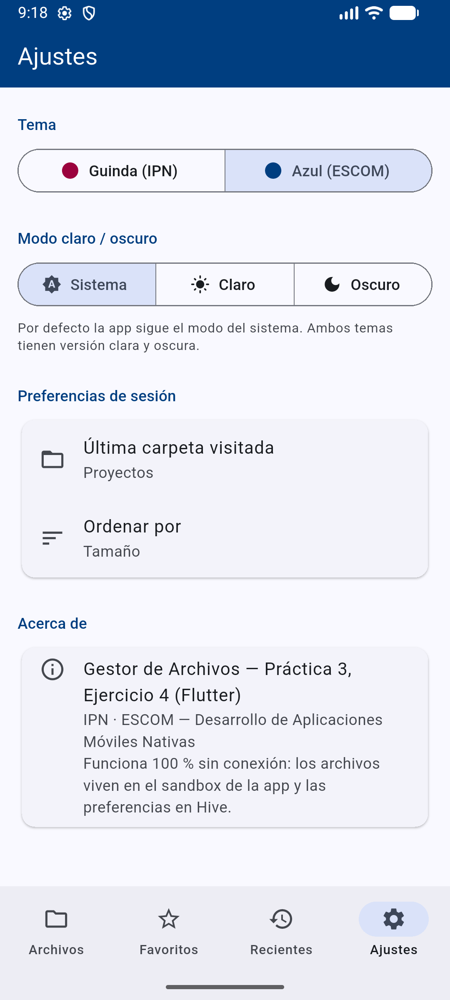 | 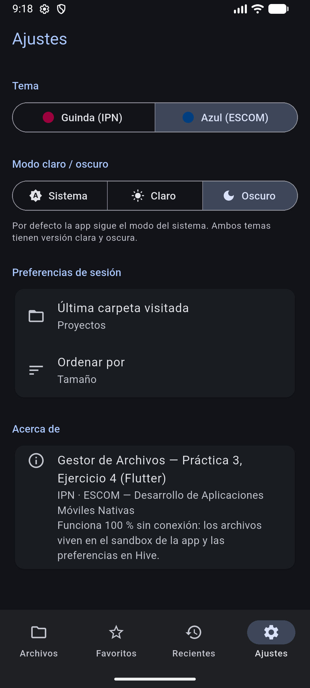 |

| Documents — Guinda oscuro | Documents — Azul oscuro |
|---|---|
| 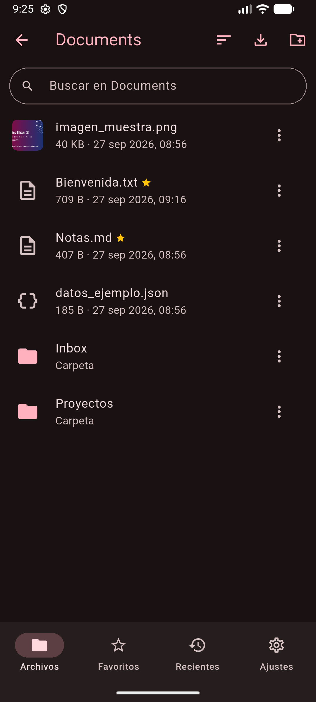 | 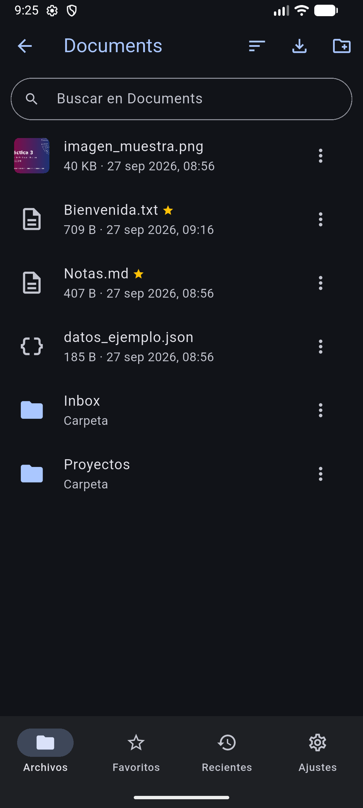 |
