# Ejercicio 5 — Cámara y Micrófono (Kotlin Multiplatform)

Aplicación multiplataforma (Android / iOS) escrita en **Kotlin Multiplatform + Compose Multiplatform**, con almacenamiento local en **SQLDelight**. Es la versión multiplataforma de la app de Cámara y Micrófono del Ejercicio 3 y funciona **100 % sin conexión a internet**.

## Estructura del proyecto

```
Ejercicio5_KotlinMultiplatform/
├── shared/                      # Módulo KMP
│   └── src/
│       ├── commonMain/          # Lógica de negocio + interfaz (Compose) compartidas
│       │   ├── kotlin/.../domain/      # Modelos: MediaItem, PhotoFilter, AppSettings
│       │   ├── kotlin/.../data/        # Repositorios sobre SQLDelight
│       │   ├── kotlin/.../platform/    # Declaraciones expect (archivos, cámara, audio, permisos…)
│       │   ├── kotlin/.../ui/          # Pantallas: Cámara, Audio, Galería, Ajustes
│       │   └── sqldelight/             # Esquema de la base de datos (.sq)
│       ├── androidMain/         # Implementaciones actual de Android (CameraX, AudioRecord…)
│       ├── iosMain/             # Implementaciones actual de iOS (UIKit, AVFoundation…)
│       └── commonTest/          # Pruebas de la lógica compartida
├── androidApp/                  # App Android (Activity, manifiesto, permisos, ícono)
└── iosApp/                      # Proyecto de Xcode que usa el framework "Shared"
```

## expect / actual

Todo lo que cambia entre sistemas se declara con `expect` en `commonMain/.../platform/` y se implementa con `actual` en cada plataforma:

| Recurso nativo | `expect` (commonMain) | `actual` Android | `actual` iOS |
|---|---|---|---|
| Base de datos | `DatabaseDriverFactory` | `AndroidSqliteDriver` | `NativeSqliteDriver` |
| Archivos | `FileStorage` | `java.io.File` (`files/Capturas`) | `NSFileManager` (`Documents/Capturas`) |
| Cámara | `rememberCameraController()` | CameraX (vista previa en vivo) | `UIImagePickerController` (fototeca en el simulador) |
| Filtros de imagen | `ImageProcessor` | `Bitmap` + `ColorMatrix` | Core Image (`CIFilter`) |
| Micrófono | `AudioRecorder` | `AudioRecord` → WAV (ganancia por software) | `AVAudioRecorder` → M4A |
| Reproducción | `AudioPlayer` | `MediaPlayer` | `AVAudioPlayer` |
| Permisos | `rememberPermissionState()` | Activity Result API + `AndroidManifest.xml` | `AVCaptureDevice` / `AVAudioSession` / `CLLocationManager` + `Info.plist` |
| Ubicación | `LocationProvider` | `LocationManager` (GPS) | `CLLocationManager` |
| Compartir | `ShareHelper` | `Intent.ACTION_SEND` + `FileProvider` | `UIActivityViewController` |
| Botón "atrás" | `PlatformBackHandler` | `BackHandler` | (no aplica) |
| Fecha / hora | `formatDateTime`, `currentTimeMillis` | `SimpleDateFormat` | `NSDateFormatter` |

## Almacenamiento local (SQLDelight)

Tabla `CapturedItem`, con los mismos campos que la entidad de Core Data del Ejercicio 3: `id`, `type`, `fileName`, `dateCreated`, `albumName`, `tags`, `isFavorite`, `latitude`, `longitude`, `hasLocation`, `duration`. Las preferencias (tema, modo claro/oscuro, álbum por defecto) se guardan en la tabla `AppSetting`. Los archivos de foto y audio se guardan en la carpeta `Capturas` del sandbox de la app.

## Requisitos

| Herramienta | Versión |
|---|---|
| Android Studio | Reciente (con el plugin de Kotlin Multiplatform recomendado) |
| JDK | 17 o superior (el que trae Android Studio sirve) |
| Android SDK | Plataforma 37 (Gradle la descarga sola la primera vez) |
| Gradle | 9.3.1 (se descarga con el wrapper) |
| Kotlin / Compose Multiplatform / SQLDelight | 2.4.10 / 1.11.1 / 2.4.0 |
| iOS (opcional) | Mac con **Apple Silicon** y Xcode 16 o superior |

## Instalación y ejecución en Android

**Opción A — Android Studio (recomendada)**
1. *File → Open…* y elegir la carpeta `Ejercicio5_KotlinMultiplatform`.
2. Esperar a que termine la sincronización de Gradle (la primera vez descarga dependencias; es la **única** vez que se necesita internet).
3. Elegir la configuración **androidApp** y el emulador, y presionar ▶ **Run**.

**Opción B — Terminal (PowerShell)**
```powershell
cd Ejercicio5_KotlinMultiplatform
$env:JAVA_HOME = "C:\Program Files\Android\Android Studio\jbr"   # JDK de Android Studio
.\gradlew.bat :androidApp:installDebug
```
Después abrir la app **Cámara y Micrófono** en el emulador.

> Si Gradle no encuentra el Android SDK, crear `local.properties` con
> `sdk.dir=C\:\\Users\\<usuario>\\AppData\\Local\\Android\\Sdk` (Android Studio lo crea solo).

**Generar el APK**
```powershell
.\gradlew.bat :androidApp:assembleRelease
```
El APK queda en `androidApp\build\outputs\apk\release\androidApp-release.apk` (firmado con la llave de depuración para poder instalarlo directamente).

**Pruebas**
```powershell
.\gradlew.bat :shared:testAndroidHostTest
```

## Ejecución en iOS

1. En una Mac con Apple Silicon, abrir `iosApp/iosApp.xcodeproj` en Xcode.
2. Elegir un simulador de iPhone y presionar ▶. Xcode ejecuta `./gradlew :shared:embedAndSignAppleFrameworkForXcode` para compilar el módulo compartido.

En el simulador no hay cámara física, así que al tomar una foto se abre la fototeca como alternativa (igual que en el Ejercicio 3).

## Uso

| Pestaña | Qué hace |
|---|---|
| **Cámara** | Vista previa en vivo, flash (⚡), filtros (Ninguno, Sepia, Blanco y negro, Vívido) y temporizador (3/5/10 s). Al tomar la foto se elige el álbum y se guarda con fecha y ubicación (si se dio permiso). |
| **Audio** | Grabación con medidor de nivel, sensibilidad del micrófono y temporizador de grabación (15/30/60 s o sin límite). Si no hay micrófono disponible se genera un audio de respaldo silencioso con la duración grabada. |
| **Galería** | Fotos y audios guardados, filtrables por álbum. Una foto se puede rotar, reaplicar filtro, marcar como favorita, cambiar de álbum/etiquetas, compartir y eliminar. Un audio se puede reproducir (con barra de progreso), marcar como favorito, compartir y eliminar. |
| **Ajustes** | Tema **Guinda (IPN)** / **Azul (ESCOM)**, modo **Sistema / Claro / Oscuro** y álbum por defecto. |

Los permisos de cámara, micrófono y ubicación se piden en tiempo de ejecución la primera vez que se usan.

**En el emulador de Android:** la cámara trasera muestra una escena virtual 3D. Para grabar con el micrófono de la PC, activar *Extended controls (⋯) → Microphone → "Virtual microphone uses host audio input"*.

## Pruebas realizadas

Probado en el emulador de Android Studio (Medium Phone, Android 17 / API 37), sin conexión a internet: permisos, captura con filtros, grabación y reproducción de audio, galería con filtro por álbum, edición de fotos (rotar, filtro, favorito), cambio de tema/modo y persistencia de datos y ajustes al cerrar y volver a abrir la app. Las 8 pruebas de `commonTest` cubren la lógica compartida (formato de duración y coordenadas, álbumes, encabezado WAV, audio de respaldo, preferencias y tipos MIME).

| Situación | Detalle | Solución aplicada |
|---|---|---|
| Guardado cancelado al cambiar de pestaña | Si se guardaba una foto y se cambiaba de pestaña mientras se obtenía la ubicación (hasta 3 s), el guardado se cancelaba junto con la pantalla | Los guardados se ejecutan en `AppContainer.appScope` (ámbito de toda la app) |
| Duración del audio en el emulador | El micrófono virtual del emulador entrega muestras más rápido que el tiempo real (8 s grabados duraban 27 s) | `AudioRecorder` (Android) descarta el excedente según el tiempo real transcurrido; en un teléfono real no recorta nada |
| Pantalla negra en el emulador | Tras varias reinstalaciones seguidas el emulador dejó de dibujar la app (la app sí corría) | *Cold Boot* del emulador desde el Device Manager |
| Ubicación en el emulador | Las fotos quedan "Sin ubicación" porque el GPS simulado no entregó posición dentro del límite de 3 s | En un dispositivo real, o fijando una ubicación en *Extended controls → Location*, sí se guarda |
| iOS | Compose Multiplatform necesita Mac con Apple Silicon y Xcode 16+; la VM Intel con Xcode 14.3.1 del Ejercicio 1 no es compatible | `iosMain` e `iosApp` listos para compilarse en una Mac compatible |

## Evidencia

| Permiso de cámara | Vista previa en vivo |
|---|---|
| 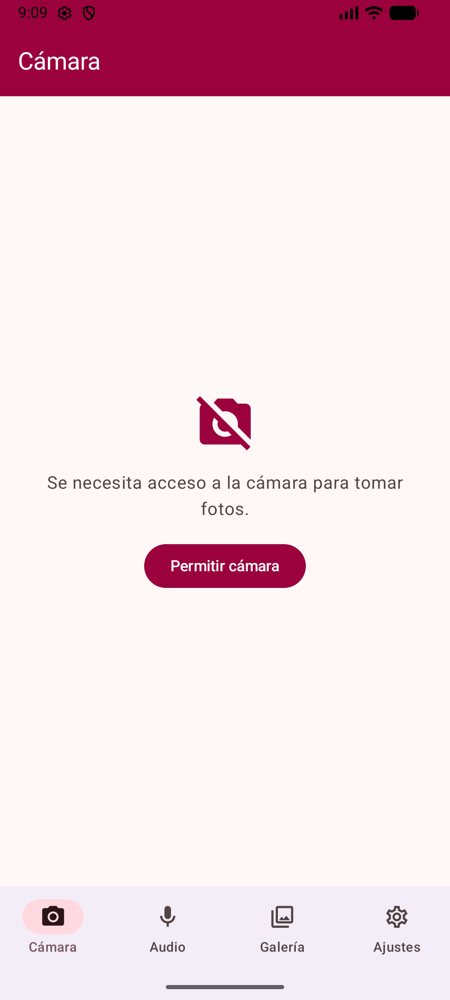 | 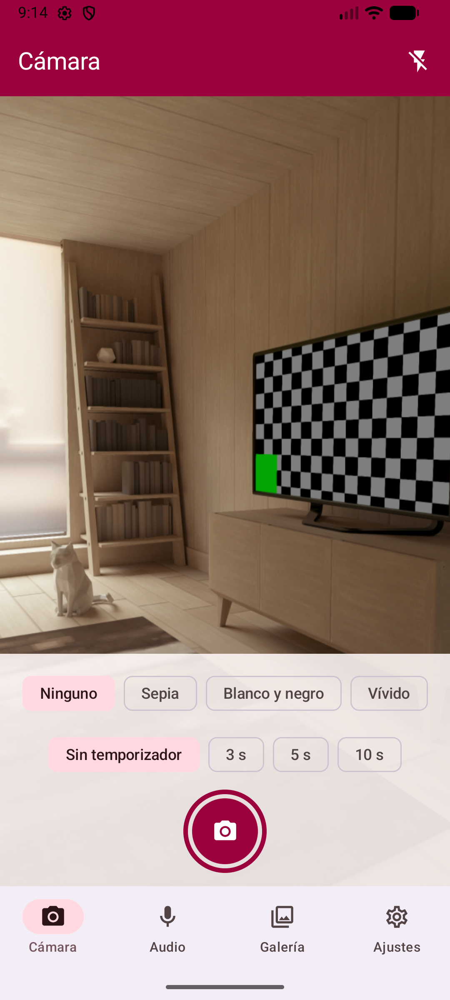 |

| Guardar foto (elegir álbum) | Permiso de ubicación |
|---|---|
| 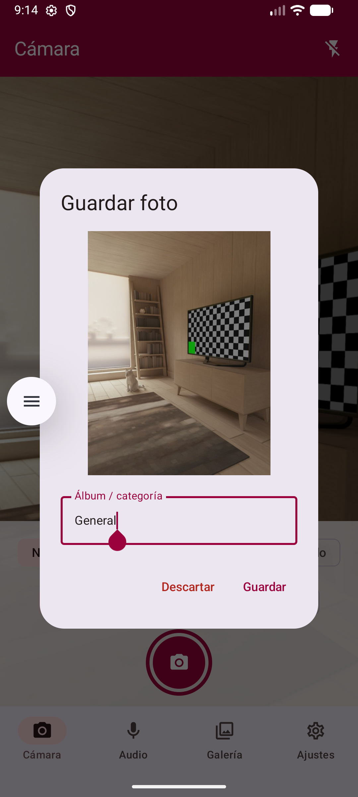 | 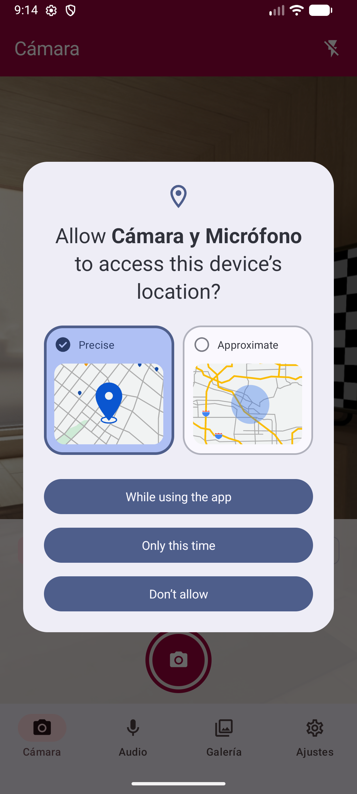 |

| Filtro Sepia + álbum | Permiso de micrófono |
|---|---|
| 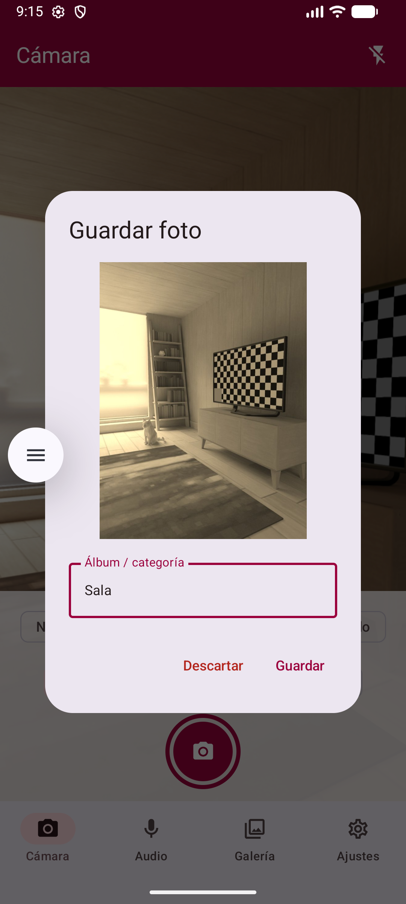 | 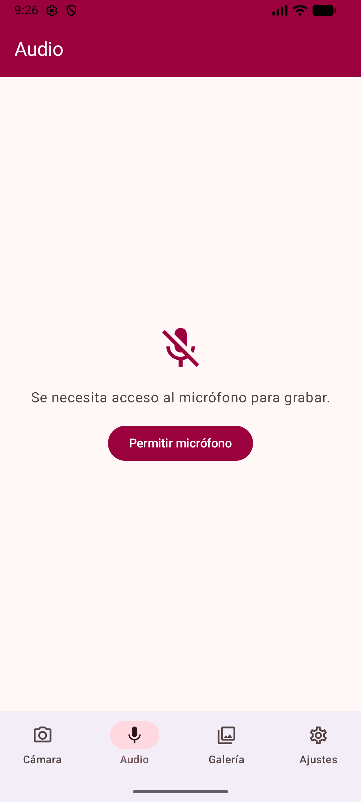 |

| Grabando audio | Guardar audio |
|---|---|
| 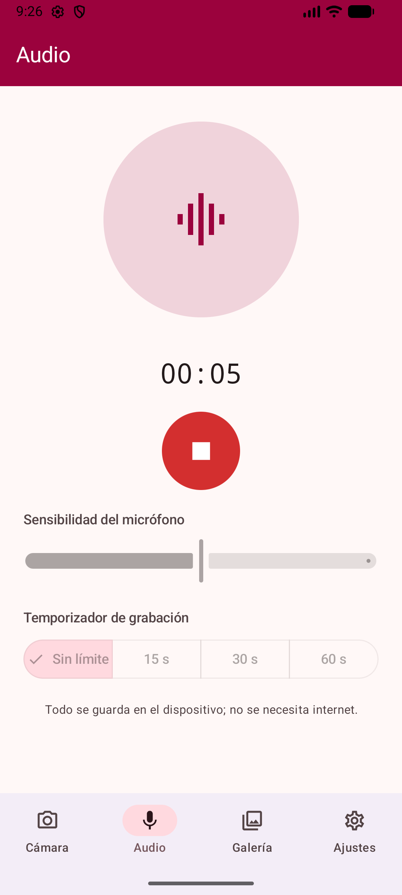 | 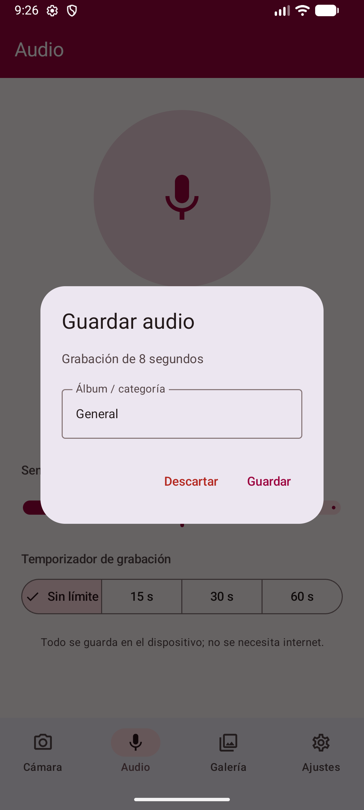 |

| Galería | Detalle de foto |
|---|---|
| 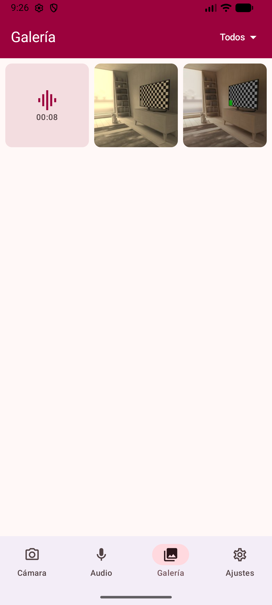 | 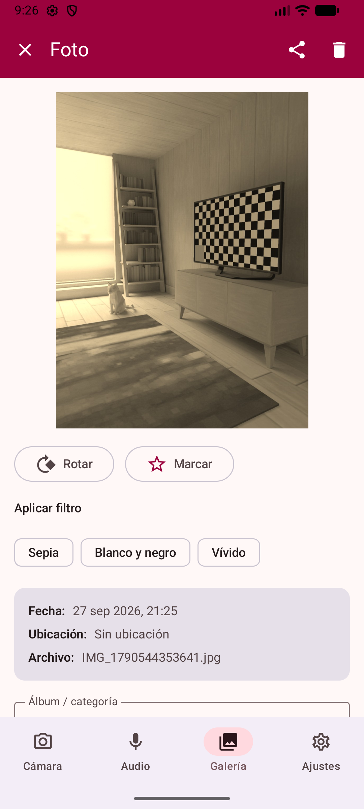 |

| Rotar y marcar favorito | Reaplicar filtro Blanco y negro |
|---|---|
| 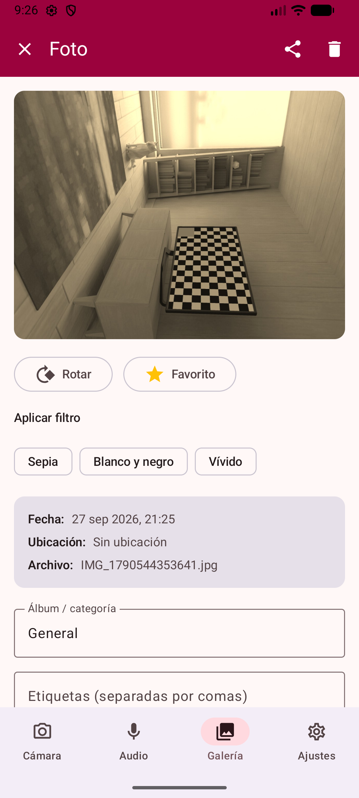 | 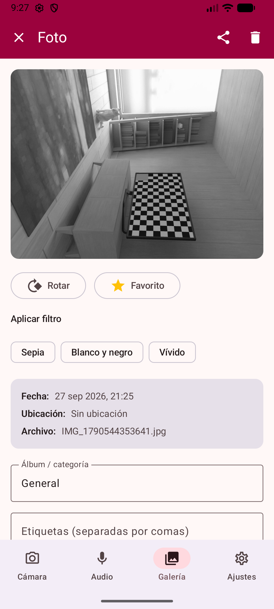 |

| Reproductor de audio | Ajustes — Guinda claro |
|---|---|
| 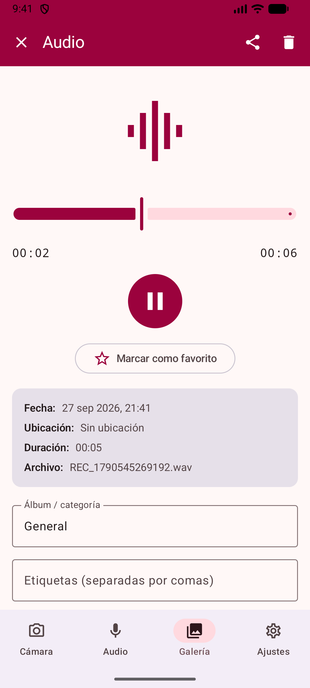 | 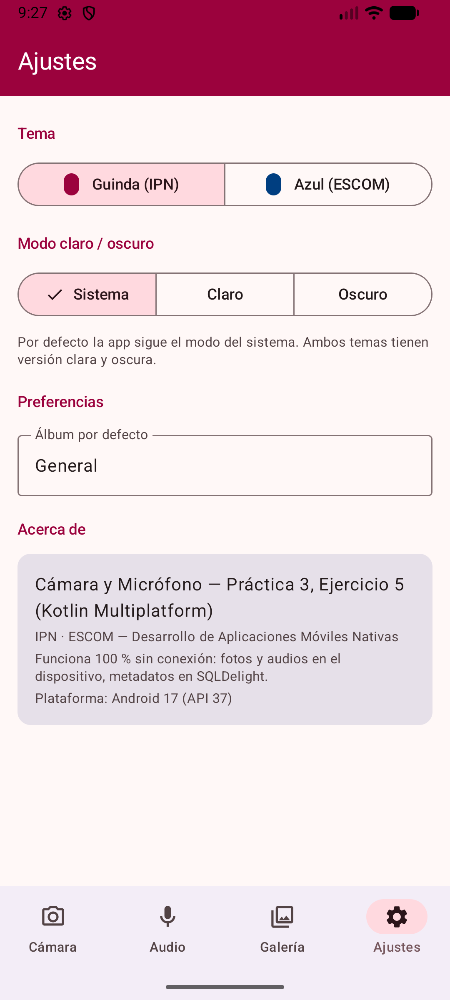 |

| Ajustes — Azul claro | Ajustes — Azul oscuro |
|---|---|
| 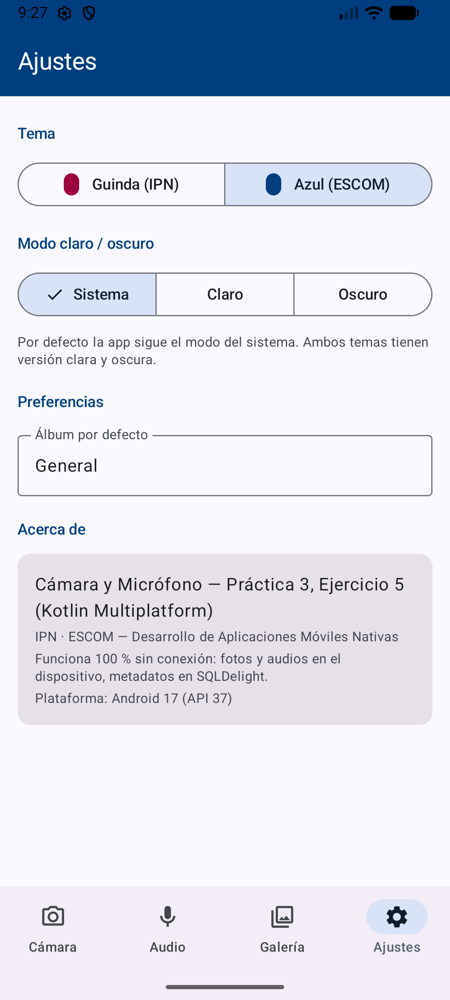 | 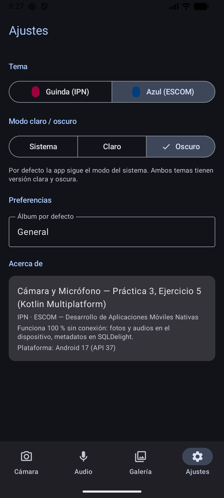 |

| Galería — Azul oscuro | Filtro por álbum |
|---|---|
| 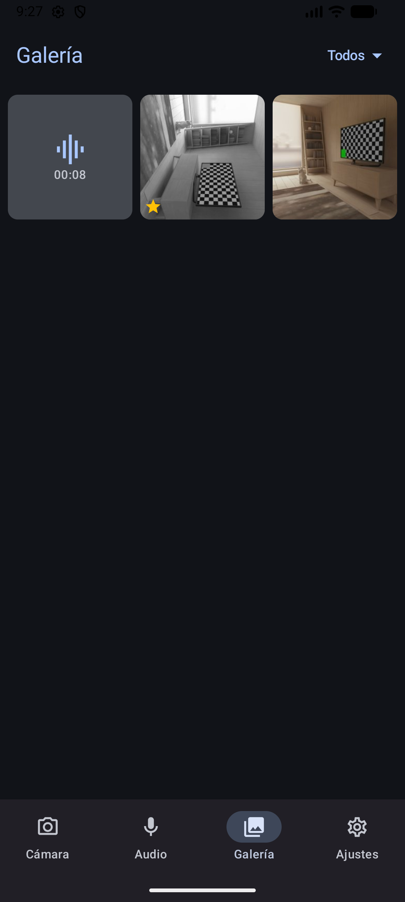 | 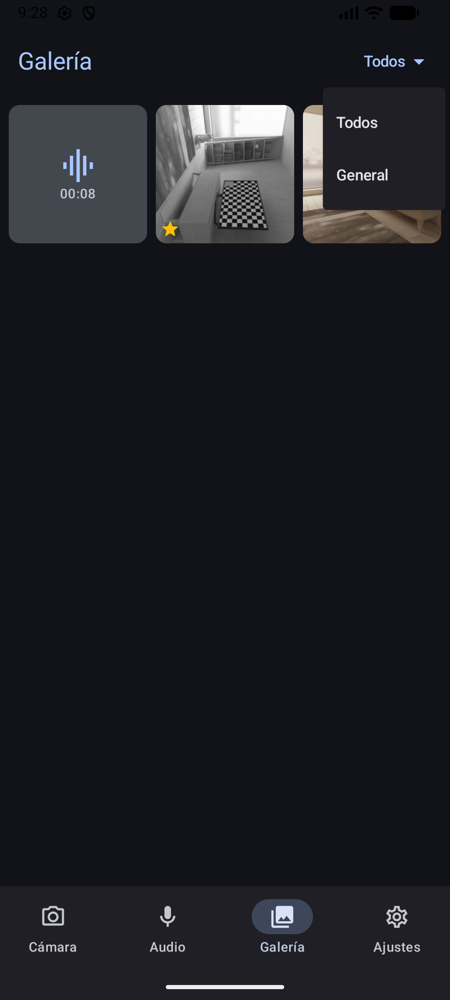 |

| Audio — Guinda oscuro | Cámara — Guinda oscuro |
|---|---|
| 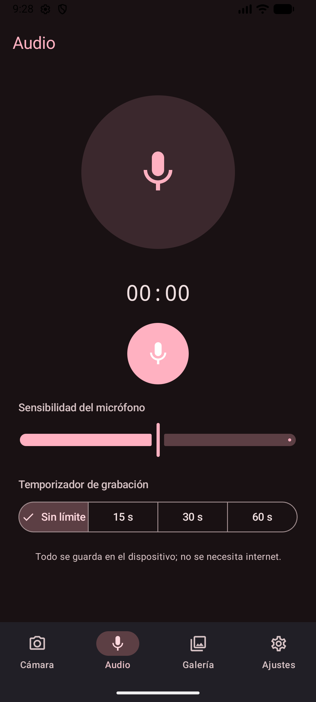 | 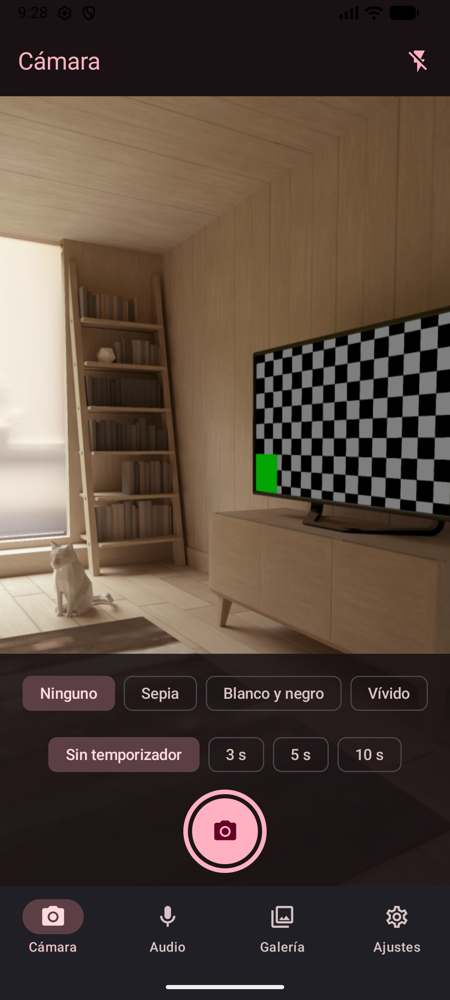 |

| Datos y ajustes tras reiniciar la app |
|---|
| 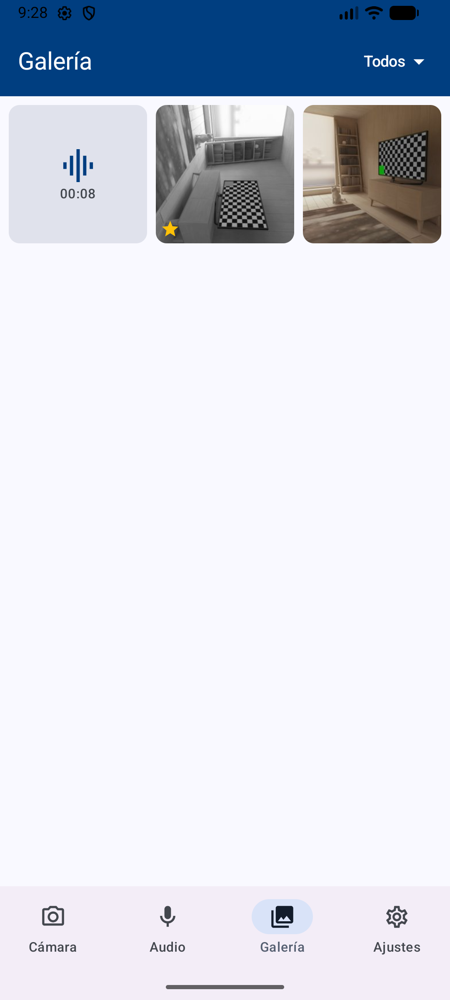 |
