# Práctica 3: Aplicaciones Nativas

Proyecto en equipo para la materia de **Desarrollo de Aplicaciones Móviles Nativas** — IPN, ESCOM.

La práctica consta de 5 ejercicios. Este repositorio reúne el trabajo de ambos integrantes del equipo:

| Ejercicio | Descripción | Plataforma | Responsable |
|---|---|---|---|
| 1 | Instalación y configuración del entorno de desarrollo nativo (iOS) | macOS / Xcode | Julio Olascoaga |
| 2 | Gestor de archivos nativo | iOS (Swift/SwiftUI) | Julio Olascoaga |
| 3 | Aplicación de cámara y micrófono | iOS (Swift/SwiftUI) | Julio Olascoaga |
| 4 | Aplicación multiplataforma — Gestor de archivos | Flutter (Android / iOS) | Diego Hernández |
| 5 | Aplicación multiplataforma — Cámara y micrófono | Kotlin Multiplatform (Android / iOS) | Diego Hernández |

> Los nombres del equipo en la tabla son un punto de partida — ajusta o completa según corresponda.

## Estructura del repositorio

```
.
├── README.md
├── Ejercicio1_Entorno/              # Notas de instalación del entorno (ver abajo)
├── Ejercicio2_GestorArchivos/       # Proyecto Xcode — Gestor de Archivos
├── Ejercicio3_CamaraMicrofono/      # Proyecto Xcode — Cámara y Micrófono
├── Ejercicio4_Flutter/              # Proyecto Flutter
├── Ejercicio5_KotlinMultiplatform/  # Proyecto Kotlin Multiplatform
├── binarios/                        # APK release de los Ejercicios 4 y 5
├── capturas/                        # Evidencia de cada ejercicio
└── Comparativa_Flutter_vs_KMP.md    # Tabla comparativa para el informe (sección 5.5)
```

---

## Ejercicio 1 — Entorno de desarrollo

El desarrollo nativo de iOS (Ejercicios 2 y 3) se hizo **sin una Mac física**, usando una máquina virtual de macOS anidada:

- **Host:** Windows + WSL2
- **VM:** macOS Ventura vía [docker-osx](https://github.com/sickcodes/docker-osx) (QEMU/KVM)
- **IDE:** Xcode 14.3.1
- **Simulador:** iPhone 14, iOS 16.4

Esta configuración es funcional pero tiene limitaciones de hardware/servicios frente a una Mac real, que se documentan en el Ejercicio 3 porque ahí es donde se notan (cámara, micrófono, GPU).

### Evidencia

| Especificaciones de la PC usada | Instalación de WSL2 |
|---|---|
| 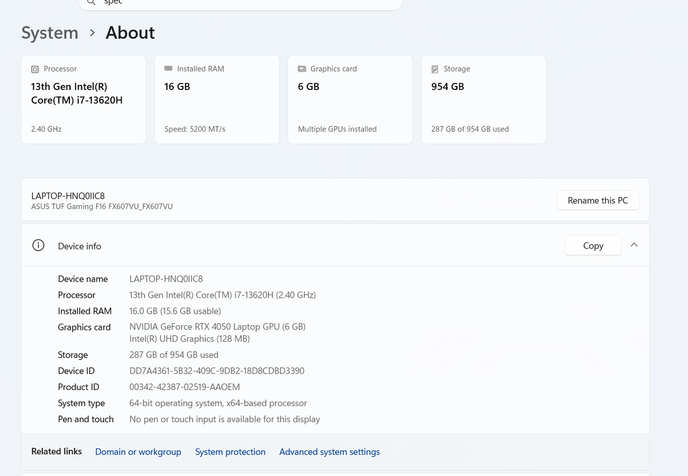 | 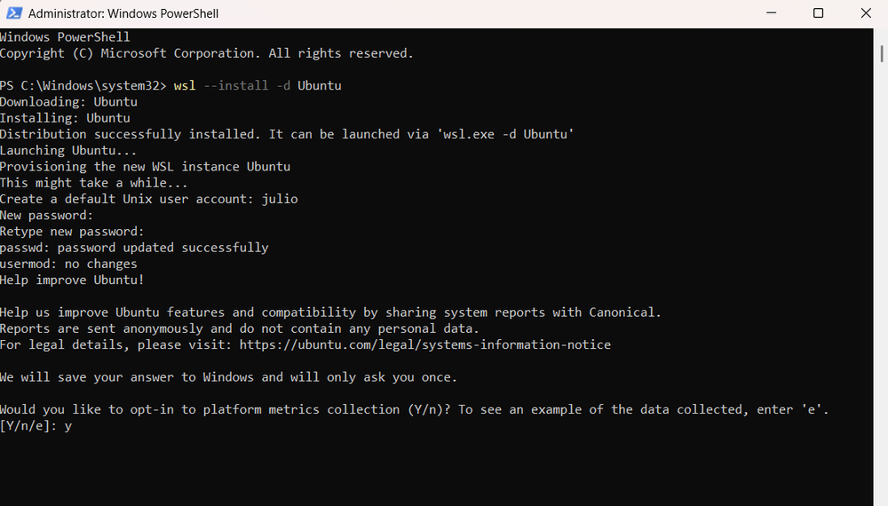 |

| macOS Ventura en QEMU (docker-osx) | Proyecto de prueba SwiftUI en el simulador |
|---|---|
| 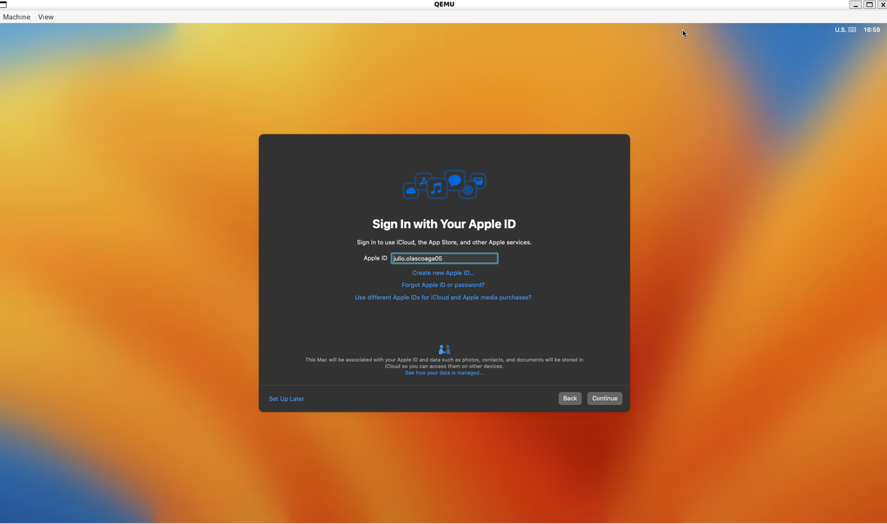 | 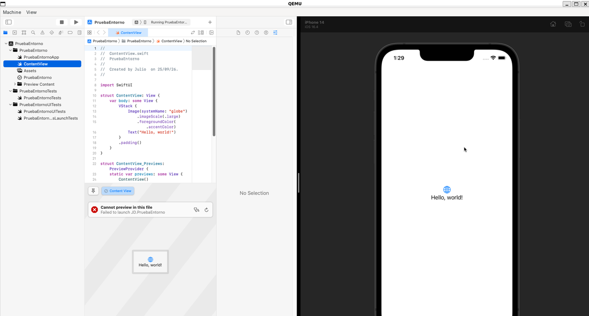 |

---

## Ejercicio 2 — Gestor de Archivos

**Carpeta:** `Ejercicio2_GestorArchivos/` · Swift 5 + SwiftUI

Gestor de archivos con sandbox propio de la app (`Documents/Inbox`), con las siguientes funciones:

- Explorador de carpetas con navegación (`NavigationStack`), creación de carpetas, búsqueda y ordenamiento (nombre, fecha, tamaño).
- Importar archivos desde el sistema (`UIDocumentPickerViewController`) y exportar/compartir (`UIActivityViewController`).
- Visor de archivos: imágenes con zoom, y vista previa de otros tipos con `QLPreviewController`.
- Iconos por tipo de archivo (`UTType`) y miniaturas cacheadas (`NSCache`) para que la galería cargue rápido.
- Gestos: swipe para acciones rápidas, menú contextual (mantener presionado), pull-to-refresh.
- Favoritos y persistencia de preferencias con `UserDefaults`; acceso a carpetas externas con *security-scoped bookmarks*.
- Temas institucionales **Guinda (IPN)** y **Azul (ESCOM)**, adaptados a modo claro/oscuro.

**Archivos principales:** `FileBrowserView`, `FileBrowserViewModel`, `FileSystemService`, `FileSystemModels`, `FileViewers`, `FileRowView`, `DestinationPickerView`, `PersistenceStores`, `SystemWrappers`, `AppTheme`, `RootTabView`, `GestorArchivosApp`.

### Evidencia

| Proyecto en Xcode | Build settings (iOS 16.4) |
|---|---|
| 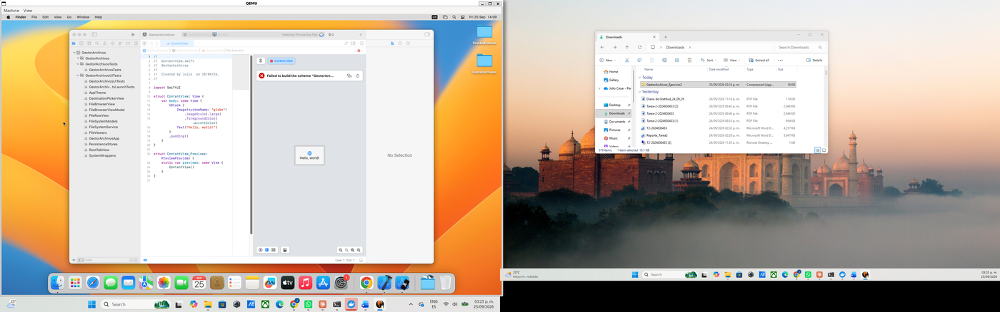 | 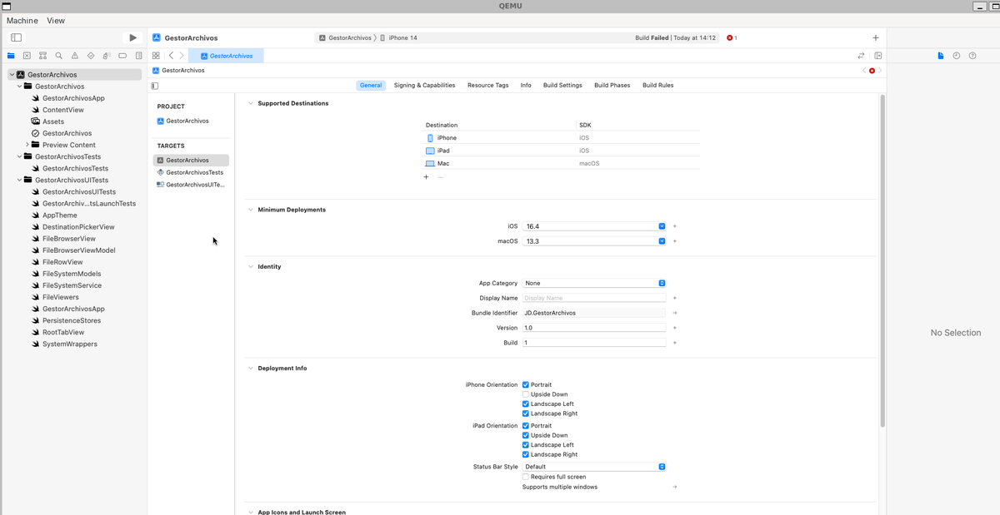 |

| Pantalla principal (Documents / Inbox / Temporal) | Favoritos |
|---|---|
| 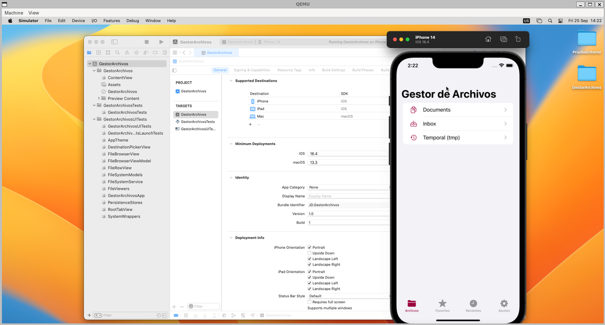 | 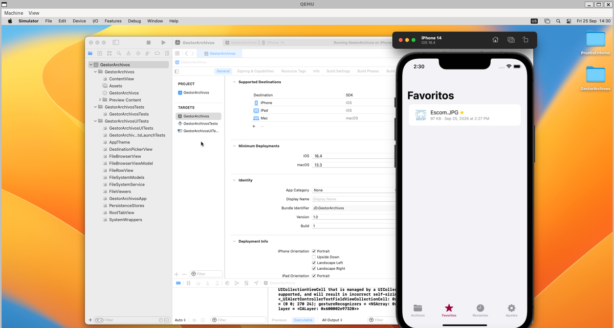 |

### Cómo ejecutarlo
1. Abrir `Ejercicio2_GestorArchivos/` en Xcode (14.0+).
2. Seleccionar un simulador de iPhone.
3. `Cmd/⊞ + R` para compilar y correr.

---

## Ejercicio 3 — Cámara y Micrófono

**Carpeta:** `Ejercicio3_CamaraMicrofono/` · Swift 5 + SwiftUI + AVFoundation + Core Data

App con cuatro pestañas: **Cámara**, **Audio**, **Galería**, **Ajustes**.

### Cámara
- Captura con `AVCaptureSession` / `AVCapturePhotoOutput`, flash y temporizador (3/5/10 s).
- Filtros con Core Image (`CIFilter`): Sepia, Blanco y negro, Vívido.
- El simulador de iOS no tiene cámara física: como alternativa documentada, se puede elegir una foto de la fototeca (`PHPickerViewController`).

### Audio
- Grabación con `AVAudioRecorder`: medidor de nivel, "sensibilidad" (ganancia de entrada, cuando el hardware lo permite) y temporizador de grabación (15/30/60 s o sin límite).
- Reproducción con `AVAudioPlayer` (progreso, favoritos).
- Alternativa para importar un archivo de audio existente cuando no hay micrófono disponible en el entorno.

### Galería y edición
- Galería con `@FetchRequest` de Core Data, filtrable por álbum.
- Edición básica: rotar, reaplicar filtro, favoritos, etiquetas/álbum, compartir, eliminar.

### Core Data
Entidad `CapturedItem` (modelo `CamaraMicrofono.xcdatamodeld`): `id`, `type`, `fileName`, `dateCreated`, `albumName`, `tags`, `isFavorite`, `latitude`, `longitude`, `hasLocation`, `duration`. La ubicación se obtiene de forma opcional y no bloqueante (`CLLocationManager`, con *timeout* de 3 s).

**Archivos principales:** `CameraCaptureView`, `AudioRecorderView`, `AudioPlayerView`, `GalleryView`, `PhotoDetailView`, `MediaStore`, `PersistenceController`, `LocationHelper`, `AppTheme`, `RootTabView`, `CamaraMicrofonoApp`.

### Cómo ejecutarlo
1. Abrir `Ejercicio3_CamaraMicrofono/` en Xcode.
2. Seleccionar destino **iPhone 14** (o cualquier simulador de iPhone) — **no** "My Mac".
3. `Cmd/⊞ + R`.
4. Al primer uso, aceptar los permisos de cámara/micrófono/ubicación que pide el sistema.

### Limitaciones conocidas del entorno (VM anidada)
Al no correr en una Mac física, el simulador dentro de la VM carece de ciertos servicios que una Mac real sí tiene. Se documentan aquí porque son del entorno, no bugs de la app:

| Limitación | Síntoma | Solución aplicada |
|---|---|---|
| Sin cámara física | N/A en cualquier simulador de iOS | Selector de fototeca como alternativa (permitido por el enunciado) |
| Sin micrófono real en la VM | La grabación no captura audio | Si no hay hardware disponible, se genera un audio de respaldo (silencioso) con la duración grabada, para que guardar/reproducir sigan siendo funcionales de extremo a extremo; también existe la opción de importar un archivo de audio existente |
| Sin aceleración GPU/Metal | Los filtros de Core Image no se aplicaban | Se forzó el renderizado por software (`CIContext(options: [.useSoftwareRenderer: true])`) |
| Servicio de conversión de Fotos inestable | Alguna foto en particular podía fallar al elegirla de la fototeca | Manejo de error explícito: si una foto falla, se avisa en pantalla para intentar con otra, en vez de que la app se cierre |

### Evidencia

| Selección desde la fototeca (cámara) | Grabación de audio en curso |
|---|---|
| 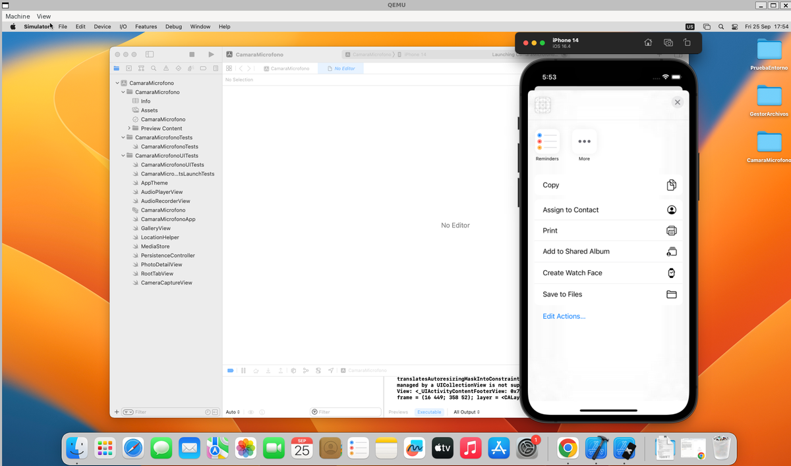 | 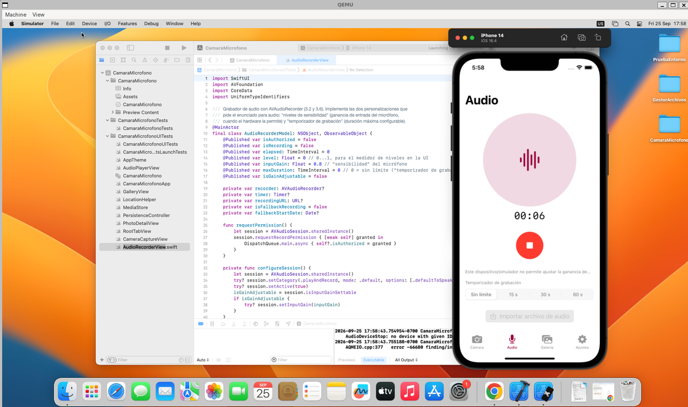 |

| Guardar grabación (16 s) | Reproducción (duración 00:16) |
|---|---|
|  | 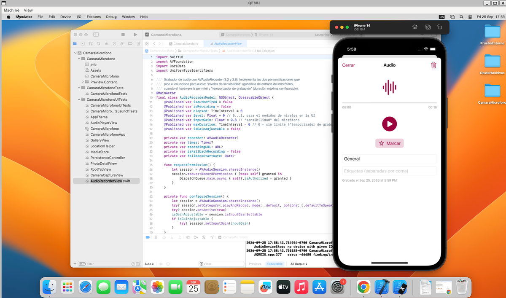 |

Durante el desarrollo también se depuraron errores de compilación reales, documentados como evidencia del proceso:

| Error de Core Data (modelo faltante) | Error de destino "My Mac" en vez de simulador |
|---|---|
| 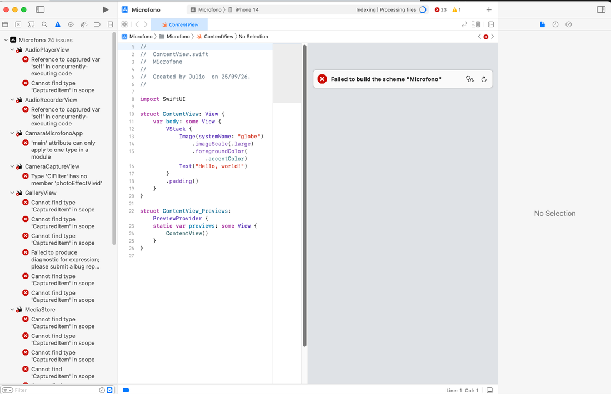 | 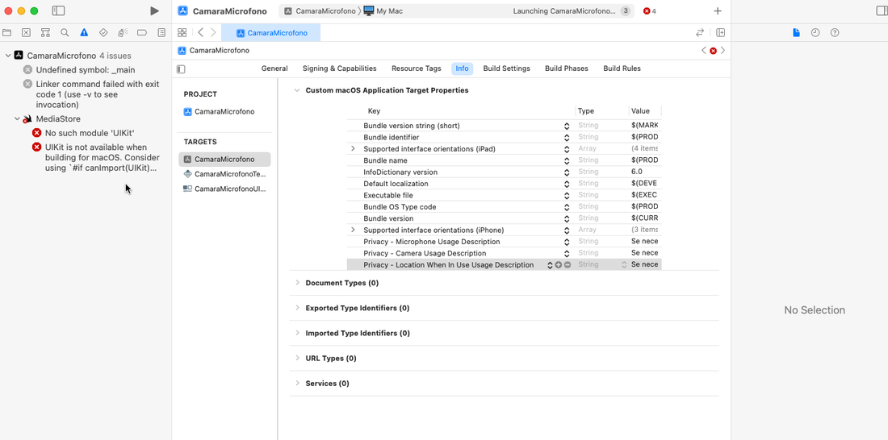 |

---

## Ejercicio 4 — Flutter

**Carpeta:** `Ejercicio4_Flutter/` · Dart + Flutter · Provider (gestor de estado) + Hive (persistencia local)

Versión multiplataforma (Android / iOS) del **Gestor de Archivos** del Ejercicio 2, con la misma lógica de negocio y la misma estructura de pestañas: **Archivos**, **Favoritos**, **Recientes**, **Ajustes**.

- Explorador del sandbox de la app (`Documents`, `Inbox`, `Temporal (tmp)`) con navegación por carpetas, búsqueda y ordenamiento (nombre, fecha, tamaño).
- Gestión de archivos: crear carpetas, renombrar, duplicar, copiar y mover (sin sobrescribir: agrega "(1)", "(2)"…), eliminar con confirmación.
- Importar archivos con el selector del sistema (`file_picker`) y compartir/exportar (`share_plus`).
- Visores: imágenes con zoom (pellizco o botones), arrastre y rotación; texto con edición y guardado; el resto de tipos se abre con el visor nativo del sistema (`open_filex`, equivalente a `QLPreviewController`).
- Íconos por tipo de archivo y miniaturas cacheadas (`ResizeImage` + `ImageCache` de Flutter, equivalente al `NSCache` del Ejercicio 2).
- Gestos: deslizar a la derecha para favorito, a la izquierda para eliminar, mantener presionado para el menú contextual, jalar para actualizar.
- Persistencia con **Hive**: tema, modo claro/oscuro, criterio de orden, última carpeta visitada, favoritos y recientes (máx. 25).
- Temas institucionales **Guinda (IPN)** y **Azul (ESCOM)** con los mismos colores del Ejercicio 2 (`#9B023D` / `#003E80`), adaptados automáticamente a modo claro/oscuro.
- Al primer arranque crea archivos de ejemplo (`.txt`, `.md`, `.json`, `.png`) para probar los visores sin conexión.

### Arquitectura limpia

```
lib/
├── core/           # Temas (AppTheme) y utilidades de formato
├── domain/         # Entidades, contratos de repositorio y casos de uso (Dart puro)
├── data/           # Implementación con dart:io, path_provider y Hive
└── presentation/   # Providers (estado), pantallas y widgets
```

**Archivos principales:** `main.dart`, `app.dart`, `app_theme.dart`, `file_item.dart`, `file_repository.dart`, `file_repository_impl.dart`, `hive_preferences_datasource.dart`, `file_browser_provider.dart`, `settings_provider.dart`, `favorites_provider.dart`, `recents_provider.dart`, `file_browser_screen.dart`, `image_viewer_screen.dart`, `text_viewer_screen.dart`, `destination_picker_screen.dart`, `root_tab_screen.dart`.

### Evidencia

| Pantalla principal (Documents / Inbox / Temporal) | Contenido de Documents (Guinda, claro) |
|---|---|
|  |  |

| Visor de imágenes con zoom | Visor/editor de texto |
|---|---|
|  |  |

| Menú contextual (mantener presionado) | Importar archivo (PDF) |
|---|---|
|  |  |

| Favoritos (persistidos en Hive) | Tema Azul (ESCOM) en modo oscuro |
|---|---|
|  |  |

Todas las capturas (16) están en [`Ejercicio4_Flutter/README.md`](Ejercicio4_Flutter/README.md).

### Cómo ejecutarlo
1. Tener instalado Flutter (3.38 o superior) y Android Studio con un emulador de Android.
2. En una terminal, entrar a `Ejercicio4_Flutter/` y correr `flutter pub get` (solo esta vez se necesita internet, para descargar dependencias).
3. Abrir el emulador y correr `flutter run`.
4. (Opcional) `flutter test` para las pruebas unitarias y de widgets.

Instrucciones detalladas (APK, iOS, uso de cada pantalla): ver [`Ejercicio4_Flutter/README.md`](Ejercicio4_Flutter/README.md).

### Notas
| Situación | Detalle | Solución aplicada |
|---|---|---|
| Plugins antiguos con Gradle 9 / AGP 9 | `file_picker 8` y `share_plus 10` no compilaban | Se actualizaron a `file_picker 13` y `share_plus 13` (nuevas APIs) |
| Carpetas internas de Flutter en Android | En modo debug, `flutter_assets` y `res_timestamp-*` aparecían dentro de Documents | Se ocultan en el listado (no son archivos del usuario) |
| Pellizco en el emulador | Con el mouse no se puede hacer zoom de dos dedos fácilmente | Se agregaron botones de acercar/alejar al visor (el pellizco sigue funcionando en un dispositivo real) |
| Compilación para iOS | Requiere Xcode 15 o superior en macOS | Pendiente de compilar en el entorno macOS del Ejercicio 1 |

---

## Ejercicio 5 — Kotlin Multiplatform

**Carpeta:** `Ejercicio5_KotlinMultiplatform/` · Kotlin Multiplatform + Compose Multiplatform · SQLDelight (persistencia local)

Versión multiplataforma (Android / iOS) de la app de **Cámara y Micrófono** del Ejercicio 3, con la misma lógica de negocio y las mismas pestañas: **Cámara**, **Audio**, **Galería**, **Ajustes**. Funciona 100 % sin conexión: la app ni siquiera declara el permiso `INTERNET`.

- **Cámara:** vista previa en vivo (CameraX en Android), flash, filtros (Ninguno, Sepia, Blanco y negro, Vívido) y temporizador (3/5/10 s). Antes de guardar se elige el álbum; se registra fecha y, si hay permiso, ubicación.
- **Audio:** grabación con medidor de nivel, sensibilidad del micrófono y temporizador de grabación (15/30/60 s o sin límite).
- **Galería:** fotos y audios filtrables por álbum. Fotos: rotar, reaplicar filtro, favorito, álbum/etiquetas, compartir y eliminar. Audios: reproductor con barra de progreso, favorito, compartir y eliminar.
- **Persistencia con SQLDelight:** tabla `CapturedItem` (mismos campos que la entidad de Core Data del Ejercicio 3) y tabla `AppSetting` (tema, modo claro/oscuro, álbum por defecto). Los archivos se guardan en la carpeta `Capturas` del sandbox de la app.
- Temas **Guinda (IPN)** y **Azul (ESCOM)** con los mismos colores de los ejercicios anteriores (`#9B023D` / `#003E80`) y modo **Sistema / Claro / Oscuro**.

### Módulos y expect/actual

```
shared/src/
├── commonMain/    # Lógica de negocio, repositorios, SQLDelight y toda la interfaz (Compose)
├── androidMain/   # actual: CameraX, AudioRecord, MediaPlayer, LocationManager, FileProvider…
├── iosMain/       # actual: UIImagePickerController, AVAudioRecorder, AVAudioPlayer, CLLocationManager…
└── commonTest/    # Pruebas de la lógica compartida
androidApp/        # App Android (MainActivity + manifiesto)
iosApp/            # Proyecto Xcode que usa el framework "Shared"
```

Todo recurso nativo que cambia entre sistemas se declara con `expect` en `commonMain/.../platform/` y se implementa con `actual` en cada plataforma: base de datos (`DatabaseDriverFactory`), archivos (`FileStorage`), cámara (`rememberCameraController`), filtros (`ImageProcessor`), micrófono (`AudioRecorder`), reproducción (`AudioPlayer`), permisos (`rememberPermissionState`), ubicación (`LocationProvider`), compartir (`ShareHelper`) y botón atrás (`PlatformBackHandler`). La tabla completa está en [`Ejercicio5_KotlinMultiplatform/README.md`](Ejercicio5_KotlinMultiplatform/README.md).

### Evidencia

| Cámara con vista previa en vivo | Guardar foto con filtro Sepia y álbum |
|---|---|
|  |  |

| Grabando audio | Galería (fotos y audios) |
|---|---|
|  |  |

| Detalle de foto: rotar y favorito | Reproductor de audio |
|---|---|
|  |  |

| Tema Azul (ESCOM) en modo oscuro | Datos y ajustes persistidos tras reiniciar la app |
|---|---|
|  |  |

Todas las capturas (21) están en [`Ejercicio5_KotlinMultiplatform/README.md`](Ejercicio5_KotlinMultiplatform/README.md).

### Cómo ejecutarlo
1. Tener instalado Android Studio con un emulador de Android.
2. *File → Open…* y elegir la carpeta `Ejercicio5_KotlinMultiplatform`. Esperar la sincronización de Gradle (solo esta vez se necesita internet, para descargar dependencias).
3. Elegir la configuración **androidApp** y el emulador, y presionar ▶ **Run**.
   - Por terminal (PowerShell): `$env:JAVA_HOME = "C:\Program Files\Android\Android Studio\jbr"` y luego `.\gradlew.bat :androidApp:installDebug`.
4. (Opcional) `.\gradlew.bat :shared:testAndroidHostTest` para las pruebas de la lógica compartida.

Instrucciones detalladas (APK, iOS, uso de cada pestaña): ver [`Ejercicio5_KotlinMultiplatform/README.md`](Ejercicio5_KotlinMultiplatform/README.md).

### Notas
| Situación | Detalle | Solución aplicada |
|---|---|---|
| Guardado cancelado al cambiar de pestaña | Si se guardaba una foto y se cambiaba de pestaña mientras se obtenía la ubicación (hasta 3 s), el guardado se cancelaba junto con la pantalla | Los guardados de fotos y audios se ejecutan en un ámbito de corrutinas de toda la app (`AppContainer.appScope`) |
| Duración del audio en el emulador | El micrófono virtual del emulador entrega muestras más rápido que el tiempo real (8 s grabados se reproducían como 27 s) | La grabación descarta el excedente según el tiempo real transcurrido; en un teléfono real no recorta nada |
| Pantalla negra en el emulador | Tras varias reinstalaciones seguidas, el emulador dejó de mostrar la app (la app sí corría) | *Cold Boot* del emulador desde el Device Manager de Android Studio |
| Ubicación en el emulador | Las fotos quedan "Sin ubicación" porque el GPS simulado no responde dentro del límite de 3 s | En un dispositivo real, o fijando una ubicación en *Extended controls → Location*, sí se guarda |
| Compilación para iOS | Compose Multiplatform requiere una Mac con Apple Silicon y Xcode 16 o superior; la VM macOS del Ejercicio 1 (Intel, Xcode 14.3.1) no es compatible | El código de `iosMain` y el proyecto `iosApp` quedan listos para compilarse en una Mac compatible |

---

## Binarios y comparación Flutter vs Kotlin Multiplatform

- **APK listos para instalar** (release, funcionan sin internet): [`binarios/Ejercicio4_GestorArchivos_Flutter.apk`](binarios/Ejercicio4_GestorArchivos_Flutter.apk) (53.2 MB) y [`binarios/Ejercicio5_CamaraMicrofono_KMP.apk`](binarios/Ejercicio5_CamaraMicrofono_KMP.apk) (15.1 MB). Para instalarlos en un teléfono Android, copiar el APK y abrirlo (permitir "instalar apps de origen desconocido"), o arrastrarlo al emulador.
- **Tabla comparativa detallada** entre ambas tecnologías (lenguaje, interfaz, APIs nativas, código compartido, tamaño del binario, curva de aprendizaje, madurez): [`Comparativa_Flutter_vs_KMP.md`](Comparativa_Flutter_vs_KMP.md).
